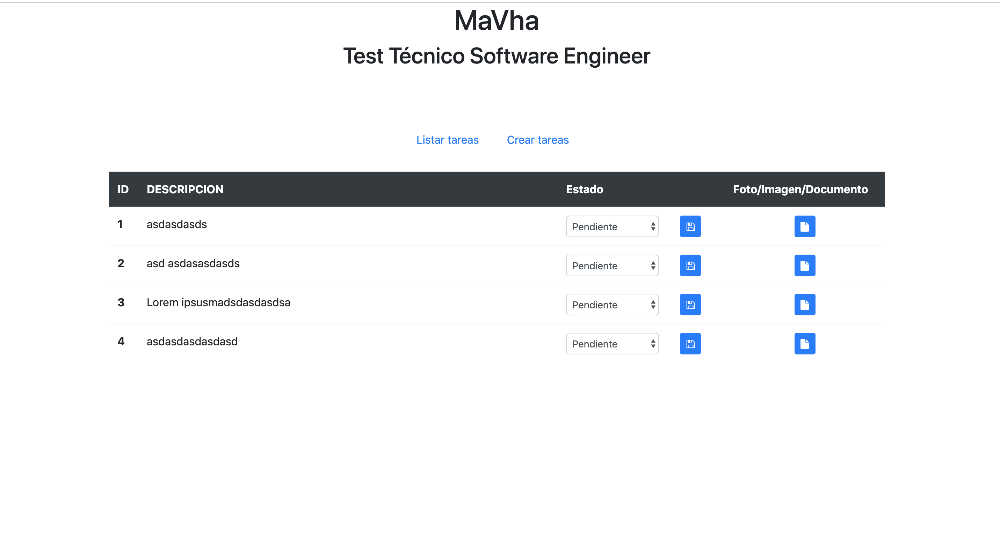

# Test MaVha Test Técnico Software Engineer
Implementar una solución que permita guardar y listar una/s  Entidad/es TODOs con las siguientes características:
TODO (To do, listado de tareas por hacer)
A ) ID
B) DESCRIPCION (EL TODO a hacer)
C) Estado

# Instalar dependencias proyecto Angular
npm install

# levantar proyecto proyecto Angular
ng serve --port 4200 --open

# Listar tareas
- lista tareas guardadas
- permite cambio de estado tarea
- permite descargar archivo adjunto a tarea imagen/documento

# Crear tareas
- permite generar tareas
